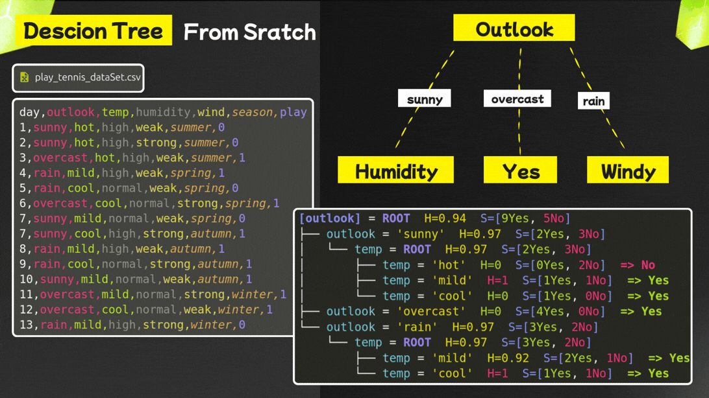

# Decision Tree From Scratch

In this project I am trying to implement a Decision Tree From Scratch basically it is binary classification (response 0 or 1)
using Native python Statements (**LOOPS, CONDITIONS, FUNCTIONS, ...**) without using any library (numpy, pandas, ...)



as you see in this picture we need dataset and based on the dataset we build the tree and then we display.
so building the tree is big part.

---

## Steps Followed To Build Decision Tree

**GOAL:** the main goal is build decision tree that can tell is that today I will play tennis or no based on some features.

---

### Get DataSet

for me I use simple dataset contain features (outlook, temp, humidity, wind, season, play) that mean:

- **outlook:** accept three values: sunny, overcast, rain
- **temp:** hot, cool, mild
- **humidity:** high, normal
- **wind:** weak, strong
- **season:** summer, spring, autumn, winter
- **play:** 0 (no), 1 (yes)

> **NOTE:** you can check `play_tennis_dataset.csv`

---

### Get Root Of Tree
in this part we should know what root features (which features that will be in root of tree).
to do this we should Calculate Information Gain for each feature. we take feature that has biggest gain.

📐 here is mathematical formula:

``` bash
Gain(S, A) = Entropy(S) - Σ ( |S_v| / |S| ) * Entropy(S_v)
```

Where:
``` bash
S = the whole dataset (all rows).
A = the feature we are checking (like temp, outlook, etc.).
v = each unique value of feature A (like sunny, rain, hot, high).
|S_v| = number of rows in the dataset where A = v (we need to extract subSet from dataSet).
|S| = total number of rows in the dataset.
Entropy(S_v) = the entropy of the subset of rows where A = v.
```

``` bash
Entropy(S) = -p⁺ log₂(p⁺) - p⁻ log₂(p⁻)
```

WHERE:

``` bash
p⁺ = proportion of positive samples (play = 1) in S
p⁻ = proportion of negative samples (play = 0) in S
```


---

### Build Tree
✔ after finding the root we need to find the children for each element and may be add more nodes, for do this:
- I Implement `create_node()` to store:
  - Feature name, value, entropy, counts `[yes, no]`, and children.
- I Implement `add_child()` to connect nodes.

✔ For each feature I create subset of Dataset and Continue splitting recursively until:
- Entropy = 0 → assign leaf label (`Yes`/`No`).
- No features left → assign **majority label**.

✔ I implement `buildTree()`:
- Calculate gain on subsets.
- Create nodes and assign children.
- Recursively build all branches until leaf nodes.

---

### Display Tree
- Implement `display_tree()` for display tree With Feature names, values, entropy, counts, and labels.

```bash
┌── [outlook] = ROOT  H=0.94  S=[9Y, 5N]
    ├── outlook = 'sunny'  H=0.97  S=[2Y, 3N]
    │   └── [humidity] = ROOT  H=0.97  S=[2Y, 3N]
    │       ├── humidity = 'high'  H=0  S=[0Y, 2N]  => No
    │       └── humidity = 'normal'  H=0  S=[2Y, 0N]  => Yes
    ├── outlook = 'overcast'  H=0  S=[4Y, 0N]  => Yes
    └── outlook = 'rain'  H=0.97  S=[3Y, 2N]
        └── [wind] = ROOT  H=0.97  S=[3Y, 2N]
            ├── wind = 'weak'  H=0  S=[3Y, 0N]  => Yes
            └── wind = 'strong'  H=0  S=[0Y, 2N]  => No
```

## 📁 Project Structure

``` bash
decision-tree-from-scratch/
│
├── decision_tree.py # Main implementation
├── play_tennis_dataset.csv # Dataset
```

**IMPORTANT NOTE: This is my first time implementing this project. You can improve it by forking the repository, and feel free to contribute!**

